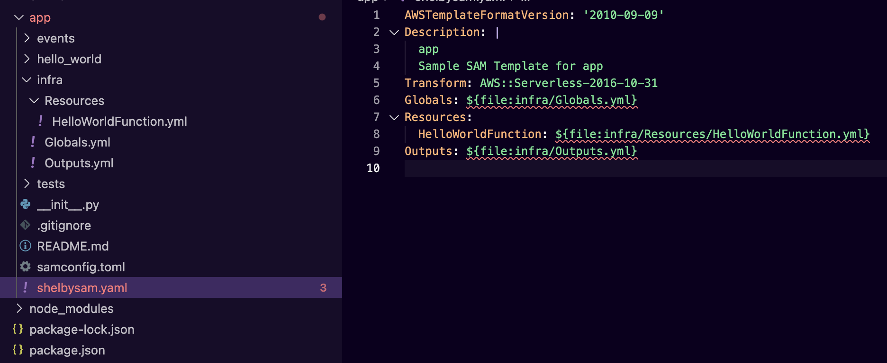
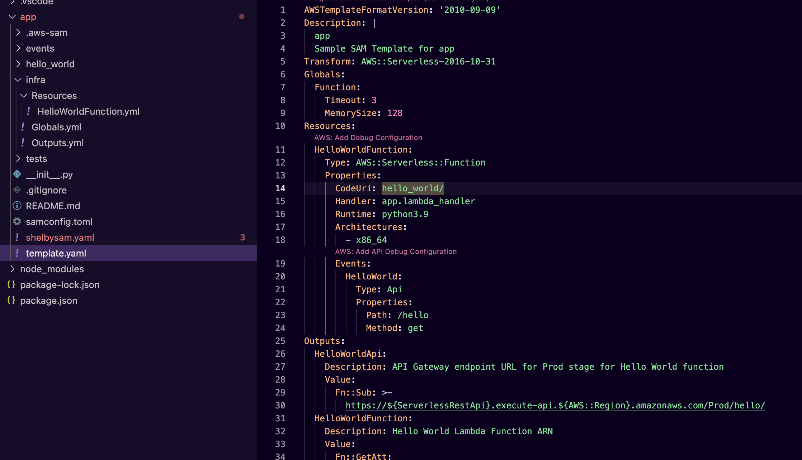

# ShelbySAM

`ShelbySAM` is an enhanced wrapper for the AWS SAM CLI, offering additional functionality. It facilitates the deconstruction of a template file into multiple resource files, simplifying maintenance and enabling seamless progress with the template file.

## Pre-requisites

- [SAM CLI](https://docs.aws.amazon.com/serverless-application-model/latest/developerguide/install-sam-cli.html)
- [rain](https://github.com/aws-cloudformation/rain)

## Installation

`npm install -g @antstackio/shelbysam`

## Initialize ShelbySAM

`shelbysam --name app_name --path deconstructed_resources_path`

The init process deconstructs the generated template file.

## Build ShelbySAM

`shelbysam build`

The build process constructs the template file.

## Path References

- `Resource1: "${file:./infra/resource1.yml}"` - Direct file reference.
- `Resource1: "${file:./infra/resource.yml:resource1}"` - File reference with nested resources.
